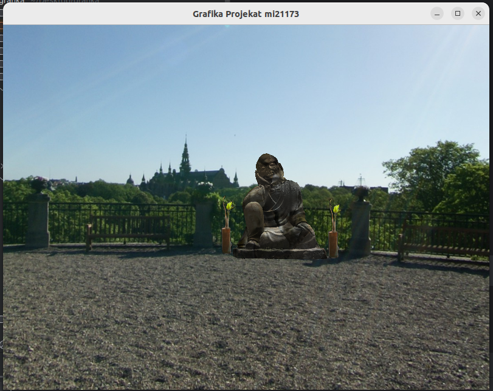

# Projekat iz grafike
U projektu su implementirane:
* Obavezne lekcije:
  * [1-7] nedelje
  * Blending
  * Face culling
  * Advanced lighting(na direkcionom tipu osvetljenja)
* Opcione lekcije:
  * Model
  * Lekcija iz grupe A:Cubemaps

# Uputstvo
	Razgledanje scene pomeranjem misa.
	
Slike za skajboks su preuzete sa sajta http://www.humus.name. 
Model je preuzet sa sajta https://www.cgtrader.com.  

# Slika ekrana

